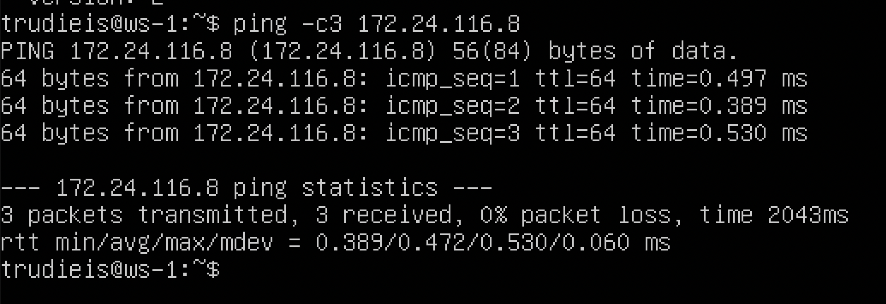
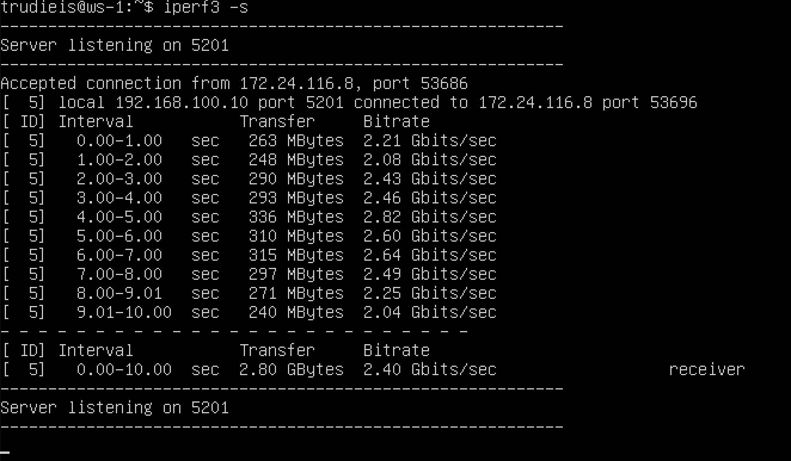
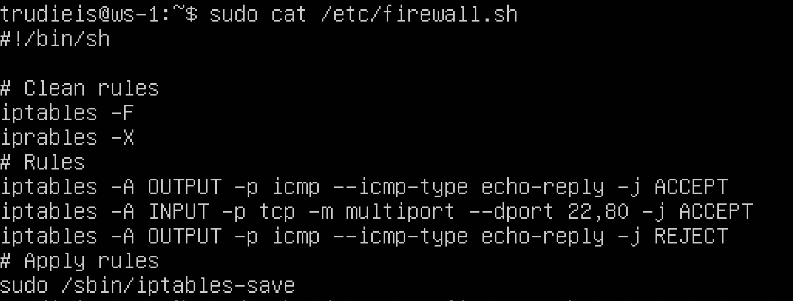
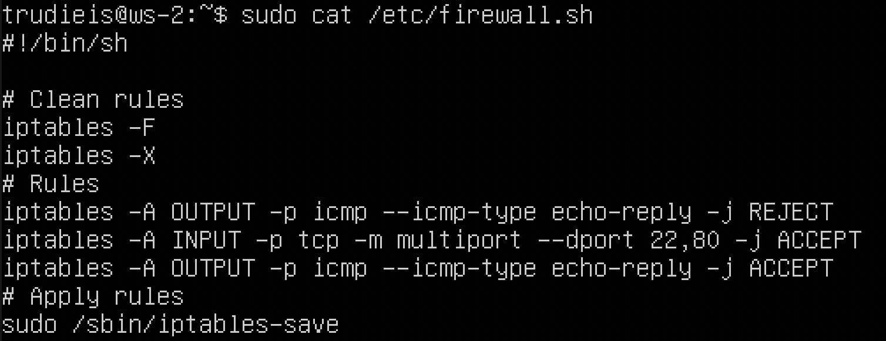
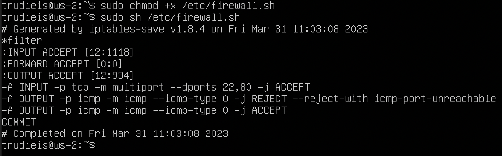
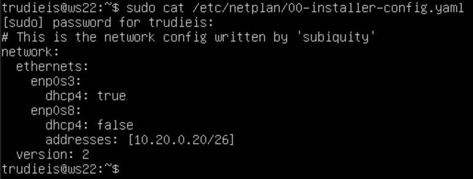

## 1.1 Сети и маски

Определить и записать в отчёт:

### адрес сети 192.167.38.54/13
  
  

### перевод маски 255.255.255.0 в префиксную и двоичную запись.

  
  префиксная форма = 24

  двоичная запись 11111111.11111111.11111111.00000000

### /15 в обычную и двоичную. 

  
  
  обычная = 255.254.0.0
  
  двоичная 11111111.11111110.00000000.00000000

### 11111111.11111111.11111111.11110000 в обычную и префиксную

  ipcalc не принимает адрес в двоичной форме, поэтому считаем ручками

  обычная = 255.255.255.240

  префиксная = 28

## 1.2 localhost
###  Определить и записать в отчёт, можно ли обратиться к приложению, работающему на localhost, со следующими IP: 

*194.34.23.100* - можно, *127.0.0.2* - нельзя, *127.1.0.1* - нельзя, *128.0.0.1* - можно.

## 1.3 Диапазоны и сегменты сетей

### 1. какие из перечисленных IP можно использовать в качестве публичного, а какие только в качестве частных: 
*10.0.0.45* - частный
*134.43.0.2* - публичный 
*192.168.4.2* - частный
*172.20.250.4* - частный
*172.0.2.1* - публичный
*192.172.0.1* - публичный
*172.68.0.2* - публичный
*172.16.255.255* - частный
*10.10.10.10* - частный
*192.169.168.1* - публичный
  
  
  
  
Частный диапазоны:
3 сегмента IP-адресов включают:
A: 10.0.0.0~10.255.255.255, 
B: 172.16.0.0~172.31.255.255
C: 192.168.0.0~192.168.255.255.

### 2. какие из перечисленных IP адресов шлюза возможны у сети: 
*10.10.0.0/18*: 
*10.0.0.1* - нет
*10.10.1.255* - да 
*10.10.100.1* - да 
*10.10.0.2*, *10.10.10.10* - да 

## Part 2. Статическая маршрутизация между двумя машинами

### Отобразить существющие интерфейсы:
#### Существующие интерфейсы ws1
  

#### Существующие интерфейсы ws2
  

### Описать сетевые интерфейсы:
#### ws1 - *192.168.100.10*, маска */16*
  

#### ws2 - *172.24.116.8*, маска */12*
  
### Выполнить команду `netplan apply` для перезапуска сервиса сети
  
  

## 2.1. Добавление статического маршрута вручную
  
  

## 2.2. Добавление статического маршрута с сохранением
  
  
  

### Пропинговать соединение между машинами

  
  

## Part 3. Утилита iperf3
### 3.1. Скорость соединения
 
8 Mbps = 1 MB/s
100 MB/s = 819200 Kbps
1 Gbps = 1024 Mbps

## 3.2. Утилита iperf3
### Измерить скорость соединения между ws1 и ws2:

  
  
  
  

## Part 4. Сетевой экран
### 4.1. Утилита iptables

Создать файл /etc/firewall.sh, имитирующий фаерволл, на ws1 и ws2:
  
  
  
  

  #### Разница между подходами в том, что в случае запрещающего правила с начала есть возможность потерять удаленный доступ к серверу. (Применяется если есть консольный доступ к серверу).
  #### В случае разрешающего, правила новые правила необходимо добавлять в цепочку перед запрещающим правилом.

## 4.2. Утилита nmap

Командой ping найти машину, которая не "пингуется", после чего утилитой nmap показать, что хост машины запущен:
  
  

## Part 5. Статическая маршрутизация сети
### 5.1. Настройка адресов машин
#### Настроить конфигурации машин в etc/netplan/00-installer-config.yaml согласно сети на рисунке.
  
  
  
  
  

### Перезапустить сервис сети. Если ошибок нет, то командой ip -4 a проверить, что адрес машины задан верно. Также пропинговать ws22 с ws21. Аналогично пропинговать r1 с ws11.
  
  
  
  
  

## 5.2. Включение переадресации IP-адресов.
  
  
  
  

## 5.3. Установка маршрута по-умолчанию
  