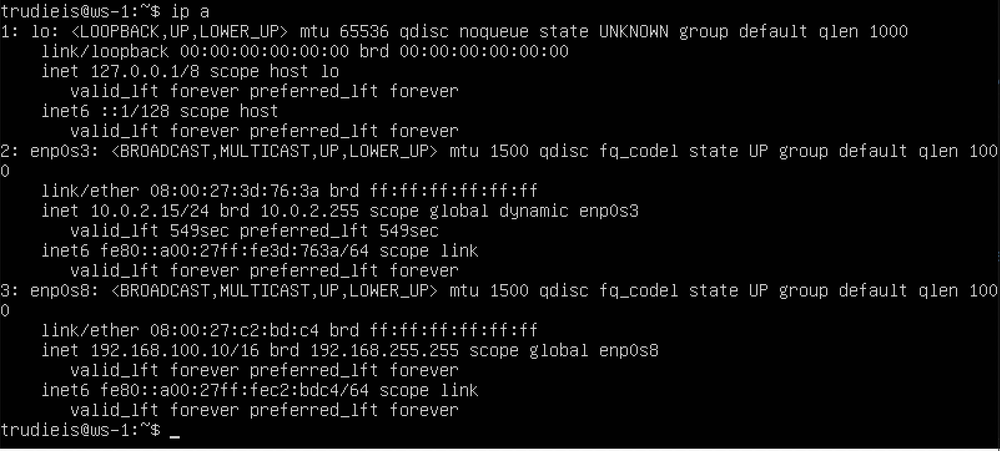
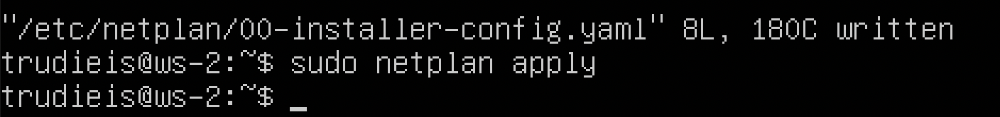
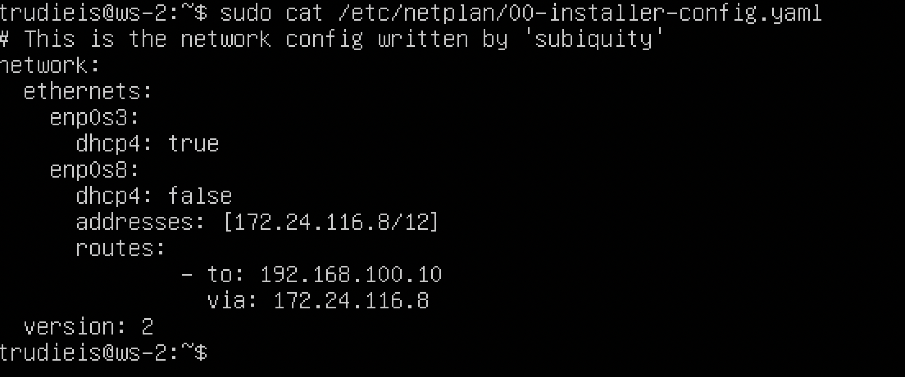
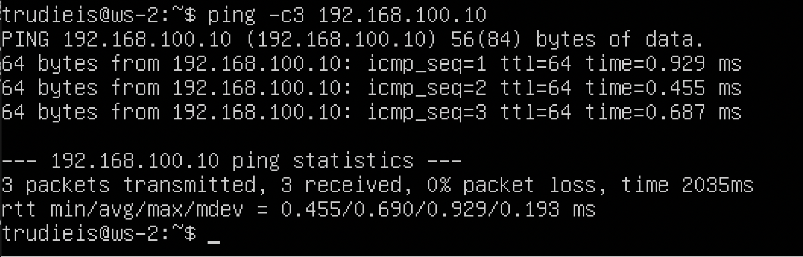
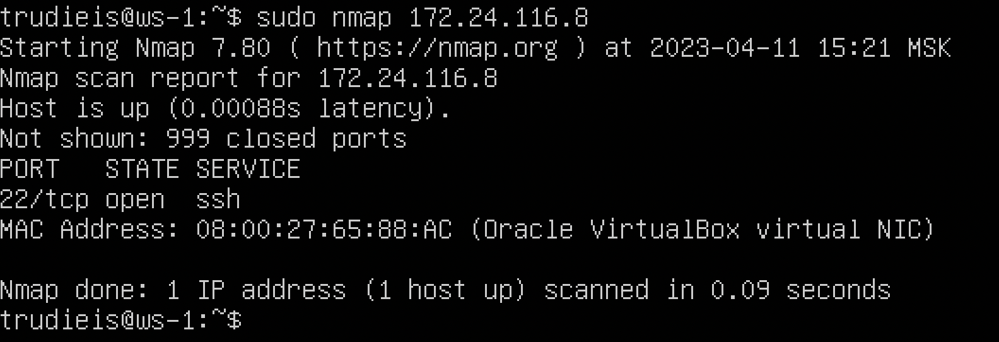
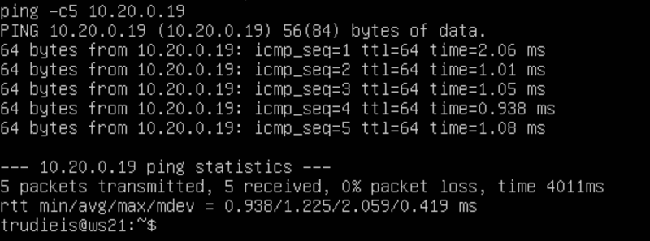
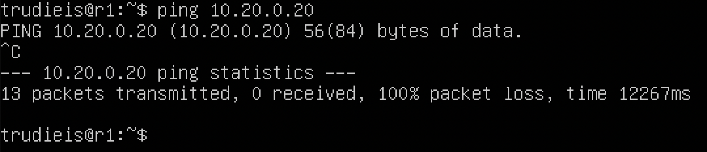
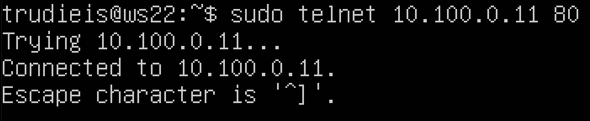
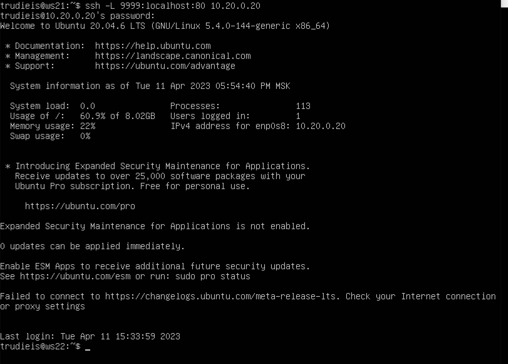

## 1.1 Сети и маски

Определить и записать в отчёт:

### адрес сети 192.167.38.54/13
  
  

### перевод маски 255.255.255.0 в префиксную и двоичную запись.

  
  префиксная форма = 24

  двоичная запись 11111111.11111111.11111111.00000000

### /15 в обычную и двоичную. 

  
  
  обычная = 255.254.0.0
  
  двоичная 11111111.11111110.00000000.00000000

### 11111111.11111111.11111111.11110000 в обычную и префиксную

  ipcalc не принимает адрес в двоичной форме, поэтому считаем ручками

  обычная = 255.255.255.240

  префиксная = 28

### 3) минимальный и максимальный хост в сети *12.167.38.4* при масках: */8* 
  
  минимальный 12.0.0.1
  максимальный 12.255.255.254
### *11111111.11111111.00000000.00000000*
  
  минимальный 12.167.0.1
  максимальный 12.167.255.254
### *255.255.254.0* 
  
  минимальный 12.167.38.1
  максимальный 12.167.39.254
### */4*
  
  минимальный 0.0.0.1
  максимальный 15.255.255.254

## 1.2 localhost
###  Определить и записать в отчёт, можно ли обратиться к приложению, работающему на localhost, со следующими IP: 

*194.34.23.100* - нельзя, *127.0.0.2* - можно, *127.1.0.1* - можно, *128.0.0.1* - нельзя.

## 1.3 Диапазоны и сегменты сетей

### 1. какие из перечисленных IP можно использовать в качестве публичного, а какие только в качестве частных: 
*10.0.0.45* - частный
*134.43.0.2* - публичный 
*192.168.4.2* - частный
*172.20.250.4* - частный
*172.0.2.1* - публичный
*192.172.0.1* - публичный
*172.68.0.2* - публичный
*172.16.255.255* - частный
*10.10.10.10* - частный
*192.169.168.1* - публичный
  
  
  
  
Частный диапазоны:
3 сегмента IP-адресов включают:
A: 10.0.0.0~10.255.255.255, 
B: 172.16.0.0~172.31.255.255
C: 192.168.0.0~192.168.255.255.

### 2. какие из перечисленных IP адресов шлюза возможны у сети *10.10.0.0/18*: 

*10.0.0.1*, *10.10.100.1* - нет 

*10.10.1.255*, *10.10.0.2*, *10.10.10.10* - да 

## Part 2. Статическая маршрутизация между двумя машинами

### Отобразить существющие интерфейсы:
#### Существующие интерфейсы ws1
  

#### Существующие интерфейсы ws2
  

### Описать сетевые интерфейсы:
#### ws1 - *192.168.100.10*, маска */16*
  

#### ws2 - *172.24.116.8*, маска */12*
  
### Выполнить команду `netplan apply` для перезапуска сервиса сети
  
  

## 2.1. Добавление статического маршрута вручную
  
  

## 2.2. Добавление статического маршрута с сохранением
  
  
  

### Пропинговать соединение между машинами

  
  

## Part 3. Утилита iperf3
### 3.1. Скорость соединения
 
8 Mbps = 1 MB/s 

100 MB/s = 800 000 Kbps

1 Gbps = 1 000 Mbps 

## 3.2. Утилита iperf3
### Измерить скорость соединения между ws1 и ws2:

  
  
  
  

## Part 4. Сетевой экран
### 4.1. Утилита iptables

Создать файл /etc/firewall.sh, имитирующий фаерволл, на ws1 и ws2:
  
  

  #### Разница между подходами в том, что в случае запрещающего правила с начала есть возможность потерять удаленный доступ к серверу. (Применяется если есть консольный доступ к серверу).
  #### В случае разрешающего, правила новые правила необходимо добавлять в цепочку перед запрещающим правилом.

## 4.2. Утилита nmap

Командой ping найти машину, которая не "пингуется", после чего утилитой nmap показать, что хост машины запущен:
  
  
  

#### Сохраняем дампы
  
  

## Part 5. Статическая маршрутизация сети
### 5.1. Настройка адресов машин
#### Настроить конфигурации машин в etc/netplan/00-installer-config.yaml согласно сети на рисунке.
  
  
  
  
  

### Перезапустить сервис сети. Если ошибок нет, то командой ip -4 a проверить, что адрес машины задан верно. Также пропинговать ws22 с ws21. Аналогично пропинговать r1 с ws11.
  
  
  
  
  

## 5.2. Включение переадресации IP-адресов.
  
  
  
  

## 5.3. Установка маршрута по-умолчанию
  
  
  

#### Вызвать ip r и показать, что добавился маршрут в таблицу маршрутизации
  
  
  
  
  
dhcpd.png
#### Пропинговать с ws11 роутер r2 и показать на r2, что пинг доходит. 
  
  

## 5.4. Добавление статических маршрутов

### Добавить в роутеры r1 и r2 статические маршруты в файле конфигураций. 
  
  

### Вызвать ip r и показать таблицы с маршрутами на обоих роутерах. 
  
  

### Запустить команды на ws11:
ip r list 10.10.0.0/[маска сети] и ip r list 0.0.0.0/0
  
  

IP 0.0.0.0 - немаршрутизируемый адрес ipv4, который используется как адрес по умолчанию или адрес-заполнитель. Приоритет сначала на заданный маршрут, если его нет то маршрутизация идет через 0.0.0.0

## 5.5. Построение списка маршрутизаторов

### Запустить на r1 команду дампа:
tcpdump -tnv -i eth0
  

### Построить список маршрутизаторов на пути от ws11 до ws21:
  
  

Программа трасероут отправляет по 3 UDP пакета с TTL=1  и смотрит адрес ответившего узла, и так дальше увеличивая TTL на единицу пока не достигнет конечного узла.

## 5.6. Использование протокола ICMP при маршрутизации

### Запустить на r1 перехват сетевого трафика, проходящего через eth0 с помощью команды:
tcpdump -n -i eth0 icmp

  

### Пропинговать с ws11 несуществующий IP (например, 10.30.0.111) с помощью команды:
ping -c 1 10.30.0.111

  

#### Дампы
  
  
  
  
  

## Part 6. Динамическая настройка IP с помощью DHCP
### Для r2 настроить в файле /etc/dhcp/dhcpd.conf конфигурацию службы DHCP:  
#### указать адрес маршрутизатора по-умолчанию, DNS-сервер и адрес внутренней сети.
  
#### Перезагрузить службу DHCP командой systemctl restart isc-dhcp-server.
  

#### в файле resolv.conf прописать nameserver 8.8.8.8.
  
  

#### Машину ws21 перезагрузить при помощи reboot и через ip a показать, что она получила адрес. 
  
  
  

#### Также пропинговать ws22 с ws21.
  
  

## Установить DHCP на машину r1

  
  

#### Указать MAC адрес у ws11

  

#### Показать адрес до

  

#### Показать после
  
  

#### Получить айпи по DHCP

  

#### Команды которыми пользовался: sudo dhclient -r сбрасывает текущий айпи, вызов команды sudo dhclient делает обращение к серверу и получает айпи.

#### Дампы
  
  
  
  
  

## Part 7. NAT
#### r1 изменяем конфиг
  
  

#### ws22 изменяем конфиг 
  
  

#### r1 запуск сервера

  

#### ws22 запуск сервера

  

#### Правила для iptables2

  

#### Пропинговать ws22 с r1

  

#### Добавить новое правило для ICMP
  
  

#### Пропинговать ws22 с r1

  

#### Добавить еще одно правило разрешающее маршрутизацию пакетов ICMP

  

#### проверить соединение между r1 и ws22

  

#### добавить еще два правила для SNAT и DNAT

  

##### Проверить соединение по TCP для **SNAT**, для этого с ws22 подключиться к серверу Apache на r1 командой:
  

##### Проверить соединение по TCP для **DNAT**, для этого с r1 подключиться к серверу Apache на ws22 командой `telnet` (обращаться по адресу r2 и порту 8080)

  

#### Дампы
  
  
  
  
  

## Part 8. Дополнительно. Знакомство с **SSH Tunnels**

##### Запустить на r2 фаервол с правилами из Части 7
  

##### Запустить веб-сервер **Apache** на ws22 только на localhost (то есть в файле */etc/apache2/ports.conf* изменить строку `Listen 80` на `Listen localhost:80`)
  
  

##### Воспользоваться *Local TCP forwarding* с ws21 до ws22, чтобы получить доступ к веб-серверу на ws22 с ws21

  

##### Открываем второй терминал на машине ws21 логинимся и проверяем телнетом

  

##### Воспользоваться *Remote TCP forwarding* c ws11 до ws22, чтобы получить доступ к веб-серверу на ws22 с ws11:

  
  

#####  Описать команды которыми пользовался:  
Для *Local TCP forwarding*: ssh -L [local_port](выбираем порт):localhost:[local_port](наш порт 80) [remote_ip](10.20.0.20)

Для *Remote TCP forwarding*: ssh -R [remote_port](выбираем порт):localhost:[local_port](наш порт 80) [remote_ip](10.20.0.20)

второй терминал открывается командой alt+F2 логинимся и телнетом проверяем соединение

#### Дампы
  
  
  
  
  